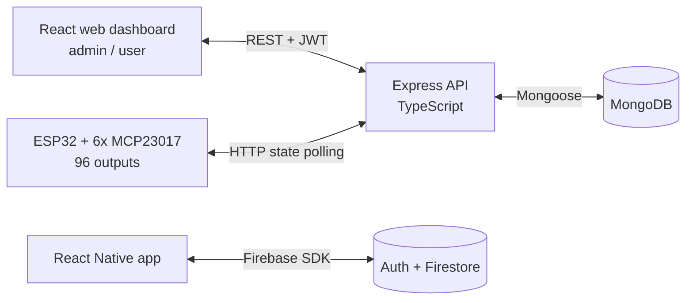

# 🏙️ Smart City Hub

[](https://nodejs.org/)
[](https://www.typescriptlang.org/)
[](https://react.dev/)
[](https://reactnative.dev/)
[](https://www.mongodb.com/)
[](https://www.espressif.com/)
[](LICENSE)

> 🇵🇱 [Wersja polska](README.pl.md)

SmartCityHub is an integrated system for managing and monitoring urban infrastructure. It combines ESP32-based IoT devices, a central Node.js/TypeScript API, a React web dashboard, and a React Native mobile app.

The web dashboard and ESP32 firmware share the Node.js/MongoDB API. The retained mobile prototype is a separate client backed by Firebase Auth and Firestore.

📄 A detailed description of the architecture and API is available in the [technical documentation](documents/DOCUMENTATION.md) ([wersja polska](documents/DOCUMENTATION.pl.md)).

**🗓️ Project period:** 2024

## 🎥 Demo — LEGO smart city

The system was built and demonstrated on a **physical LEGO city model** at the KI AT student club: ESP32 field modules polled desired states from the API and drove the model's lights and devices.

<p align="center">
  
  
</p>

<p align="center">
  
</p>

🎬 [Watch the combined LEGO lighting demo](docs/media/lego-city-demo.mp4) *(12 s, no audio)*

## Screenshots

The React web client starts with a JWT login screen before opening the user or administrator dashboard:

<p align="center">
  
  
</p>

The dashboard screenshot was rendered from the current client with representative local device data.

## Architecture



## Repository structure

```
smart_city_hub/
├── source/
│   ├── server/api/            # REST API (Node.js, Express, TypeScript, Mongoose)
│   ├── web/react/             # Web dashboard (React 18, Vite, Tailwind CSS)
│   ├── mobile/react-native/   # Mobile app (React Native + Firebase)
│   └── embedded/esp32_arduino/# ESP32 firmware (Arduino, MCP23017)
├── documents/                 # Technical/course documentation and hardware references
├── LICENSE                    # MIT
└── README.md
```

## Features

- **Device control** — up to 96 digital outputs (6 MCP23017 expanders × 16 pins) controlled remotely from the web dashboard; the ESP32 periodically polls the API for states and drives the outputs.
- **Sensor readings** — temperature, pressure, and humidity stored in the database with a reading date and device ID.
- **Roles and authentication** — JWT login with separate `admin` / `user` roles; admins manage users and devices, users control their assigned devices.
- **State history** — every device keeps a timestamped on/off history.

## Requirements

- Node.js 18+ and npm
- A MongoDB Atlas account (or a local MongoDB instance)
- For the firmware: Arduino IDE / PlatformIO with ESP32 support, the `ArduinoJson` and `MCP23017` libraries (bundled in the repo)
- For the mobile app: a React Native environment (Android Studio / Xcode) and a Firebase project

## Quick start

### 1. API (backend)

```bash
cd source/server/api
npm install
```

Create a `.env` file:

```env
PORT=4200
JWT_SECRET_KEY=<random_secret>
MONGODB_URI=mongodb+srv://<user>:<password>@<cluster>.mongodb.net/<database>
```

Run:

```bash
npm run dev     # development mode (ts-node)
npm run watch   # development mode with auto-restart (nodemon)
npm run build   # compile TypeScript to dist/
npm test        # build and run API route regression tests
```

The API listens on `http://localhost:4200` by default.

### 2. Web dashboard

```bash
cd source/web/react
npm install
```

Create a `.env` file:

```env
VITE_API_URL=http://localhost:4200/api
```

Run:

```bash
npm run dev      # Vite dev server
npm run build    # production build to dist/
npm run preview  # preview the production build
```

### 3. ESP32 firmware

1. Open `source/embedded/esp32_arduino/smart_city_iot/smart_city_iot.ino` in the Arduino IDE.
2. Copy `secrets.example.h` to the git-ignored `secrets.h` in the same directory.
3. Set the WiFi credentials, API URL, and a valid bearer token generated by the API.
4. Compile and flash to the ESP32 board (I2C bus: SDA=21, SCL=22, serial at 9600 baud).

### 4. Mobile app (optional)

The mobile app uses its own **Firebase** backend (Auth + Firestore), independent of the Node.js API.

```bash
cd source/mobile/react-native
npm install
npm start        # Metro bundler
npm run android  # or: npm run ios
```

`npm install` creates the ignored `firebaseConfig.local.ts` from the placeholder template when it is missing. Fill that local file with your Firebase project configuration before running the app.

## Tech stack

| Layer | Technologies |
|---|---|
| Backend | Node.js, Express 4, TypeScript, Mongoose 8, JWT, bcrypt, Joi |
| Database | MongoDB (Atlas) |
| Web | React 18, Vite, React Router 6, axios, Tailwind CSS, react-toastify |
| Mobile | React Native 0.73, React Navigation, Firebase (Auth, Firestore) |
| Embedded | ESP32 (Arduino), MCP23017, ArduinoJson, WiFi + HTTPClient |

## 👥 Team

| Member | Role |
|--------|------|
| **Kamil Rataj** ([@Kamilr616](https://github.com/Kamilr616)) | Author & maintainer |
| **Mateusz Ciszek** ([@Matix351](https://github.com/Matix351)) | Co-author |

## Security

Keep JWT, MongoDB, Firebase, and Wi-Fi values in the local files described above; commit only the provided templates. Report vulnerabilities using [SECURITY.md](SECURITY.md), not a public issue.

## License

Released under the [MIT](LICENSE) license. Third-party manuals and reference documents retain their publishers' terms and are not covered by the MIT license.

## 👤 Author

**Kamil Rataj** — [GitHub](https://github.com/Kamilr616) · [LinkedIn](https://www.linkedin.com/in/kamil-r-153ab7121/)
