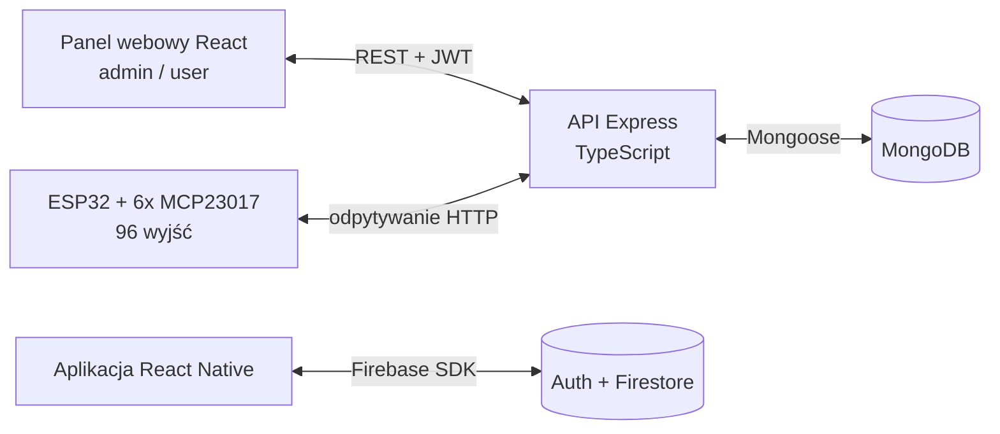

# 🏙️ Smart City Hub

[](https://nodejs.org/)
[](https://www.typescriptlang.org/)
[](https://react.dev/)
[](https://reactnative.dev/)
[](https://www.mongodb.com/)
[](https://www.espressif.com/)
[](LICENSE)

> 🇬🇧 [English version](README.md)

Smart City Hub to zintegrowany system do zarządzania i monitorowania infrastruktury miejskiej. Łączy urządzenia IoT oparte na ESP32, centralne API w Node.js/TypeScript, panel webowy w React oraz aplikację mobilną React Native.

Panel webowy i firmware ESP32 korzystają ze wspólnego API Node.js/MongoDB. Aplikacja React Native miała być kolejnym klientem tego systemu, ale integracja nie została ukończona; zachowany prototyp mobilny niezależnie korzysta z Firebase Auth i Firestore.

📄 Szczegółowy opis architektury i API znajduje się w [dokumentacji technicznej](docs/DOCUMENTATION.pl.md) ([English version](docs/DOCUMENTATION.md)).

**🗓️ Okres realizacji:** 2024

## 🎥 Demo — inteligentne miasto z LEGO

System został zbudowany i zademonstrowany na **fizycznej makiecie miasta z LEGO** w kole naukowym KI AT: moduły ESP32 pobierały z API zadane stany i sterowały światłami oraz urządzeniami makiety.

<p align="center">
  
  
</p>

<p align="center">
  
</p>

🎬 [Obejrzyj połączone demo oświetlenia LEGO](docs/media/lego-city-demo.mp4) *(33 s, z muzyką)*

Muzyka: „Soft Corporate” — MusicLFiles (CC BY 4.0). Zobacz [informacje o licencjach podmiotów trzecich](docs/THIRD_PARTY_NOTICES.md).

## Zrzuty ekranu

Klient webowy React rozpoczyna pracę od ekranu logowania JWT, a następnie otwiera panel użytkownika lub administratora:

<p align="center">
  
  
</p>

Zrzut panelu wyrenderowano z bieżącego klienta przy użyciu reprezentatywnych lokalnych danych urządzeń.

## Architektura



## Struktura repozytorium

```
smart_city_hub/
├── source/
│   ├── server/api/            # REST API (Node.js, Express, TypeScript, Mongoose)
│   ├── web/react/             # Panel webowy (React 18, Vite, Tailwind CSS)
│   ├── mobile/react-native/   # Aplikacja mobilna (React Native + Firebase)
│   └── embedded/esp32_arduino/ # Firmware ESP32 (Arduino, MCP23017)
├── docs/                      # Dokumentacja, materiały sprzętowe i multimedia
├── LICENSE                    # MIT
└── README.md
```

## Funkcje

- **Sterowanie urządzeniami** — do 96 wyjść cyfrowych (6 ekspanderów MCP23017 × 16 pinów) sterowanych zdalnie z panelu web; ESP32 cyklicznie odpytuje API o stany i ustawia wyjścia.
- **Odczyty czujników** — temperatura, ciśnienie i wilgotność zapisywane w bazie z datą odczytu i ID urządzenia.
- **Role i uwierzytelnianie** — logowanie JWT z osobnymi rolami `admin` / `user`; admin zarządza użytkownikami i urządzeniami, użytkownik steruje przypisanymi urządzeniami.
- **Historia stanów** — każde urządzenie prowadzi znacznikowaną czasowo historię włączeń/wyłączeń.

## Wymagania

- Node.js 18+ i npm
- Konto MongoDB Atlas (lub lokalna instancja MongoDB)
- Do firmware: Arduino IDE ze wsparciem płytek ESP32 oraz `ArduinoJson` 7.x; rejestry MCP23017 są obsługiwane bezpośrednio przez I2C
- Do zachowanej aplikacji mobilnej: macOS z Xcode, środowisko React Native i projekt Firebase

## Szybki start

### 1. API (backend)

```bash
cd source/server/api
npm ci
```

Skopiuj `.env.example` do `.env`, a następnie zastąp wartości przykładowe:

```env
PORT=4200
JWT_SECRET_KEY=<losowy_sekret>
MONGODB_URI=mongodb+srv://<user>:<haslo>@<cluster>.mongodb.net/<baza>
CORS_ORIGIN=http://localhost:5173
INITIAL_ADMIN_EMAIL=admin@example.com
INITIAL_ADMIN_NAME=admin
INITIAL_ADMIN_PASSWORD=<co_najmniej_12_znakow>
```

W przypadku nowej bazy jednorazowo utwórz pierwszego administratora:

```bash
npm run seed:admin
```

Polecenie jest idempotentne dla istniejącego, kompletnego administratora i odmawia nadpisania użytkownika powodującego konflikt. Po utworzeniu konta usuń `INITIAL_ADMIN_PASSWORD` z pliku `.env`.

Uruchom API:

```bash
npm run dev     # tryb deweloperski (ts-node)
npm run watch   # tryb deweloperski z auto-restartem (nodemon)
npm run build   # kompilacja TypeScript do dist/
npm test        # build i testy regresji tras API
```

API domyślnie nasłuchuje na `http://localhost:4200`.

### 2. Panel webowy

```bash
cd source/web/react
npm ci
```

Skopiuj `.env.example` do `.env` i zmień go, jeśli API działa pod innym adresem:

```env
VITE_API_URL=http://localhost:4200/api
```

Uruchom:

```bash
npm run dev      # serwer deweloperski Vite
npm run build    # build produkcyjny do dist/
npm run preview  # podgląd builda produkcyjnego
```

Serwer deweloperski Vite jest domyślnie dostępny pod adresem `http://localhost:5173`.

### 3. Firmware ESP32

1. Otwórz `source/embedded/esp32_arduino/smart_city_iot/smart_city_iot.ino` w Arduino IDE.
2. Skopiuj `secrets.example.h` do ignorowanego przez Git pliku `secrets.h` w tym samym katalogu.
3. Ustaw dane WiFi, URL API oraz prawidłowy token bearer wygenerowany przez API.
4. Skompiluj i wgraj na płytkę ESP32 (magistrala I2C: SDA=21, SCL=22, serial 9600 baud).

### 4. Aplikacja mobilna (opcjonalnie)

Integracja ze wspólnym API Node.js była planowana, ale nie została ukończona. Zachowany prototyp mobilny korzysta więc z własnego backendu **Firebase** (Auth + Firestore).

Zachowano wyłącznie natywny projekt iOS. Jego zbudowanie wymaga macOS z Xcode; repozytorium nie zawiera natywnego projektu Android.

```bash
cd source/mobile/react-native
npm ci
npm start        # bundler Metro
npm run ios
```

`npm ci` tworzy ignorowany `firebaseConfig.local.ts` z szablonu, jeżeli pliku brakuje. Przed uruchomieniem uzupełnij lokalny plik konfiguracją swojego projektu Firebase.

## Stos technologiczny

| Warstwa | Technologie |
|---|---|
| Backend | Node.js, Express 4, TypeScript, Mongoose 8, JWT, bcrypt, Joi |
| Baza danych | MongoDB (Atlas) |
| Web | React 18, Vite, React Router 6, axios, Tailwind CSS, react-toastify |
| Mobile | React Native 0.73, React Navigation, Firebase (Auth, Firestore) |
| Embedded | ESP32 (Arduino), MCP23017, ArduinoJson, WiFi + HTTPClient |

## 👥 Zespół

| Osoba | Rola |
|-------|------|
| **Kamil Rataj** ([@Kamilr616](https://github.com/Kamilr616), [LinkedIn](https://www.linkedin.com/in/kamil-r-153ab7121/)) | Autor i opiekun |
| **Mateusz Ciszek** ([@Matix351](https://github.com/Matix351)) | Współautor |
| **Marcin Golonka** ([@Golonka-Ma](https://github.com/Golonka-Ma), [LinkedIn](https://www.linkedin.com/in/marcin-golonka-4510a928b/)) | Autor prototypu React Native |

## Bezpieczeństwo

Wartości JWT, MongoDB, Firebase i Wi-Fi przechowuj w opisanych wyżej plikach lokalnych; commituj wyłącznie dostarczone szablony. Podatności zgłaszaj zgodnie z [SECURITY.md](SECURITY.md), a nie w publicznym issue.

## Licencja

Kod i dokumentacja autorstwa zespołu projektu są udostępnione na licencji [MIT](LICENSE). Dołączone i wskazane materiały podmiotów trzecich pozostają na właściwych im warunkach; zobacz [informacje o licencjach podmiotów trzecich](docs/THIRD_PARTY_NOTICES.md).
