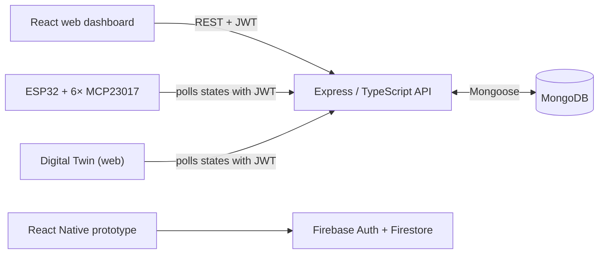

# Smart City Hub — Technical Documentation

Short technical documentation of the system. Setup instructions are in the [README](../README.md). Polska wersja: [DOCUMENTATION.pl.md](DOCUMENTATION.pl.md).

## 1. System overview

The system consists of four components:

1. **API** (`source/server/api`) — the central REST server built with Node.js/Express/TypeScript. Stores users, devices, sensor readings, and state history in MongoDB. Default port: **4200**.
2. **Web dashboard** (`source/web/react`) — a role-aware React SPA for devices, available locations, environmental charts, state history, and administrator management.
3. **ESP32 firmware** (`source/embedded/esp32_arduino`) — polls the API for current device states and drives 96 digital outputs through MCP23017 expanders.
4. **Mobile app** (`source/mobile/react-native`) — React Native; planned as a client of the shared Node.js API, but the integration was not completed. The retained prototype uses Firebase (Auth + Firestore) as an independent backend.



The original plan was to integrate the mobile app with the Node.js/MongoDB system. That work was not completed, so the retained mobile/Firebase data path remains separate and its data is not synchronized with the main system.

A third, read-only client — the [Digital Twin](https://github.com/Kamilr616/smart-city-digital-twin) web app — mirrors the physical LEGO model on screen. It polls `GET /api/state/iot/all` with a JWT exactly like the ESP32 firmware, and it lives in its own repository.

## 2. Authentication and roles

- Login: `POST /api/user/auth` returns a **JWT** token (secret: `JWT_SECRET_KEY` env variable).
- The token is passed in the `Authorization: Bearer <token>` or `x-access-token` header.
- Passwords are hashed with **bcrypt** and stored in a separate collection (`password.schema.ts`); session tokens live in the token collection (`token.schema.ts`).
- Middleware:
  - `auth.middleware` — requires a valid JWT ("user" access).
  - `admin.middleware` — requires a JWT plus the `admin` role / `isAdmin` flag.
- The web dashboard stores the token in `sessionStorage`; closing the browser tab clears the local session. The API also checks that the token is still present in the server-side token collection.

## 3. Data models (MongoDB / Mongoose)

| Model | Fields | Description |
|---|---|---|
| **User** | `email` (unique), `name` (unique), `role` (default `user`), `active`, `isAdmin` | User accounts |
| **Password** | `userId`, `password` (bcrypt hash) | Passwords, kept separate from users |
| **Token** | `userId`, `value` | Session tokens |
| **Device** | `deviceId` (Number), `location`, `name` (default `outlet`), `type`, `description`, `editDate` | Device metadata (max 96) |
| **DeviceState** | `deviceId` (ref: Device), `states[]` — `{state: Boolean, timestamp: Date}` | On/off history |
| **Sensor** | `deviceId`, `temperature`, `pressure`, `humidity`, `readingDate` | Sensor readings |

## 4. API endpoints

All routes are prefixed with `/api`. Legend: 🔓 public, 👤 requires JWT, 🛡️ requires the admin role.

### Users — `/api/user`

| Method | Path | Access | Description |
|---|---|---|---|
| POST | `/create` | 🛡️ | Create a user |
| POST | `/auth` | 🔓 | Log in, returns a JWT |
| DELETE | `/logout` | 👤 | Log out and invalidate the current token |

### Devices — `/api/device`

| Method | Path | Access | Description |
|---|---|---|---|
| GET | `/latest` | 🛡️ | Latest device data |
| GET | `/get/:location` | 🛡️ | Devices by location |
| GET | `/user/get` | 👤 | Devices assigned to the logged-in user |
| GET | `/all/:id` | 🛡️ | All entries for a device |
| GET | `/:id` | 🛡️ | A single device |
| POST | `/update` | 🛡️ | Add / update a device |
| DELETE | `/all` | 🛡️ | Delete all devices |
| DELETE | `/:id` | 🛡️ | Delete a device |

### Device states — `/api/state`

| Method | Path | Access | Description |
|---|---|---|---|
| GET | `/iot/all` | 👤 | Current states of all devices — used by the ESP32 |
| GET | `/user/latest` | 👤 | Latest states of the user's devices |
| GET | `/history/:id` | 👤 | Time-bounded state history for an authorized device |
| GET | `/latest` | 🛡️ | Latest states (all devices) |
| GET | `/all` | 🛡️ | Full state history |
| GET | `/:id` | 🛡️ | State of a specific device |
| POST | `/user/update` | 👤 | Change a device state as a user |
| POST | `/update`, `/update/:id` | 🛡️ | Change a state as an administrator |
| DELETE | `/all`, `/:id` | 🛡️ | Delete state history |

### Sensors — `/api/sensor`

| Method | Path | Access | Description |
|---|---|---|---|
| GET | `/all/latest` | 🔓 | Latest readings from all sensors |
| GET | `/history/:id` | 👤 | Time-bounded temperature, humidity, and pressure history |
| GET | `/all` | 🔓 | Latest 20 readings for each configured sensor |
| GET | `/all/:num` | 🛡️ | Return the last positive *num* readings for each configured sensor |
| GET | `/:id` | 🛡️ | Readings from a sensor |
| POST | `/iot/update` | 🛡️ | Validate and store a batch of sensor readings |
| POST | `/update/:id` | 🛡️ | Update a reading |
| DELETE | `/all`, `/:id` | 🛡️ | Delete readings |

Both history routes require a verified JWT that remains present in the token store. Query parameters `from` and `to` are ISO timestamps with a timezone; the range must be positive and no longer than 31 days. Omitting them selects the previous 24 hours. `limit` accepts 1–2000 and defaults to 1000. Results are chronological and report `truncated` when more matching observations exist.

State history also authorizes the device by location: a regular user's role must match `Device.location`; an administrator can read every device. Administrator access accepts either `role: admin` or the supported `isAdmin` claim. Its `initialState` is the last stored state before `from`, or `null` when unknown. If the result is truncated, clients must not bridge the omitted interval from that baseline.

## 5. Web dashboard — flow

1. `Login.jsx` → `POST /api/user/auth` → the JWT is stored for the current browser tab in `sessionStorage`; protected routes reject expired sessions.
2. `PanelLayout` loads devices, latest states, sensor definitions, and latest readings every 30 seconds. Ordinary accounts see devices and sensors for their role/location; administrators see all.
3. `Devices` replaces the former `Home Lights` view. It filters devices, updates assigned states through `POST /api/state/user/update`, and opens per-device history from `GET /api/state/history/:id`.
4. `Locations` is computed from the device and sensor locations available to the account rather than from a separate location store.
5. Sensor charts load `GET /api/sensor/history/:id` for temperature, humidity, and pressure over 1 hour, 24 hours, 7 days, or 30 days. Live data is the default. The optional DEMO mode starts off and generates browser-memory samples only; it does not call a write endpoint.

Charts preserve missing values instead of inventing measurements. A device state before the first stored observation remains unknown, and a truncated history leaves its omitted leading interval blank. Registering a sensor creates metadata only: without connected ESP hardware, no real readings appear.

## 6. ESP32 firmware

- **Hardware:** ESP32 + 6× MCP23017 on the I2C bus (addresses `0x22`–`0x27`), 96 outputs in total; SDA=21, SCL=22; UART at 9600 baud.
- **Operation:** after connecting to WiFi, the sketch periodically calls `GET /api/state/iot/all` (with a token in the `x-access-token` header), parses the exact 96-element JSON state array (`ArduinoJson`), and writes the required MCP23017 registers directly over I2C. Array position equals `deviceId`; missing devices are represented as `false`.
- **Configuration:** copy `secrets.example.h` to the ignored `secrets.h` and set the WiFi SSID, API URL, and bearer token before flashing.

### 6.1 Historical NXP/LPCXpresso references

The following official NXP resources were collected during the project's research phase. They concern the LPCXpresso55S69/MCUXpresso platform and are not required to build the ESP32-based Smart City Hub firmware:

- [LPCXpresso55S69 MCUXpresso SDK documentation](https://mcuxpresso.nxp.com/mcuxsdk/latest/html/boards/LPC/lpcxpresso55s69/index.html) — board-specific overview and documentation index
- [Getting Started with an MCUXpresso SDK package](https://mcuxpresso.nxp.com/mcuxsdk/latest/html/gsd/package.html)
- [MCUXpresso SDK release notes for LPCXpresso55S69](https://mcuxpresso.nxp.com/mcuxsdk/latest/html/boards/LPC/lpcxpresso55s69/releaseNotes/rnindex.html)
- [MCUXpresso SDK changelog for LPCXpresso55S69](https://mcuxpresso.nxp.com/mcuxsdk/latest/html/boards/LPC/lpcxpresso55s69/changeLog/clindex.html)
- [LPC55S69 driver API reference](https://mcuxpresso.nxp.com/mcuxsdk/latest/html/drivers/LPC/LPC5500/LPC55S69/index.html)
- [FreeRTOS in MCUXpresso SDK](https://mcuxpresso.nxp.com/mcuxsdk/latest/html/rtos/freertos/index.html)
- [LPCXpresso55S69 development-board page and UM11158](https://www.nxp.com/design/design-center/software/development-software/mcuxpresso-software-and-tools-/lpcxpresso-boards/lpcxpresso55s69-development-board%3ALPC55S69-EVK)

## 7. Environment configuration

| Component | Variable | Description |
|---|---|---|
| API | `PORT` | Server port (default 4200) |
| API | `JWT_SECRET_KEY` | JWT signing secret |
| API | `MONGODB_URI` | MongoDB Atlas connection string |
| API | `CORS_ORIGIN` | Comma-separated list of allowed web origins (default `http://localhost:5173`) |
| API seed | `INITIAL_ADMIN_EMAIL` | Email used only by `npm run seed:admin` |
| API seed | `INITIAL_ADMIN_NAME` | Login name used only by `npm run seed:admin` |
| API seed | `INITIAL_ADMIN_PASSWORD` | Initial password (minimum 12 characters); remove it after seeding |
| Web | `VITE_API_URL` | API base URL with or without a trailing `/api`; both forms are normalized |
| Mobile | `firebaseConfig.local.ts` | Local Firebase web configuration copied from the checked-in template |
| Firmware | `secrets.h` | Local Wi-Fi SSID, API URL and bearer token copied from `secrets.example.h` |

Copy each checked-in `.env.example` to `.env` before running the relevant component. For a fresh MongoDB database, run `npm run seed:admin` from `source/server/api` once. The command does not overwrite an existing conflicting user and is safe to rerun for an already complete administrator.

`.env` files are not versioned (`.gitignore`). Never commit the initial administrator password.

## 8. API runtime and Vercel deployment

The API has two entry points with separate responsibilities:

- `source/server/api/lib/index.ts` is the local process entry point. It connects to MongoDB, starts `app.listen()` on `PORT`, and owns signal handling.
- `source/server/api/api/index.ts` is the Vercel entry point. It exports the shared Express application created by `lib/createApp.ts` as the default handler; importing it does not listen on a port, connect to MongoDB, or register process signal handlers.

For serverless requests, `lib/database.ts` connects lazily and caches an in-flight connection attempt within one warm function instance. A ready Mongoose connection is reused, while failed attempts and disconnected state can retry. `serverSelectionTimeoutMS` is 5 seconds; it limits server selection, not every database query.

The request order is CORS middleware, database middleware, then controllers. A CORS preflight therefore completes before any database connection attempt. If MongoDB is unavailable, API routes return a generic JSON 503 with the `Database unavailable` error, without exposing a URI or raw driver error.

### Vercel configuration

| Setting | Value |
|---|---|
| Root Directory | `source/server/api` |
| Framework Preset | Other |
| Install Command | `npm ci` |
| Build Command | `npm run typecheck && npm run build` |
| Output Directory | `dist/public` |

The output directory is only the static site. The serverless function comes from `api/index.ts`, and `vercel.json` rewrites `/api/:path*` to `/api`, preserving the path, method, query, and body for Express. The static `/` landing page remains independent of database availability.

Set `JWT_SECRET_KEY`, `MONGODB_URI`, and `CORS_ORIGIN` in Preview and Production. `PORT` is local-only. Configure MongoDB Atlas network access for the deployment's actual Vercel egress; do not assume that unrestricted `0.0.0.0/0` access is required.

### Verification and diagnostics

From the repository root, run (select the API project when linking):

```bash
npm --prefix source/server/api test
vercel link
vercel pull --yes --environment=preview
vercel build --local-config source/server/api/vercel.json
```

Run Vercel CLI commands from the repository root: the CLI applies the project's `source/server/api` Root Directory itself. Running `vercel build --local-config source/server/api/vercel.json` inside the backend directory duplicates that path.

`npm test` includes type checking, the build, route regressions, database connection reuse/retry coverage, passive serverless-handler import, CORS preflight, database-failure responses, and bcrypt login with JWT issuance and revocation. A deployable result also requires inspection of `.vercel/output/functions` and `.vercel/output/config.json`, followed by smoke tests against a real Preview URL. Verify at least `GET /` (200 static HTML even without the database) and `GET /api/state/iot/all` without a token (application 401 when the database is available). Do not commit `.vercel` or downloaded environment files.

A Vercel platform 404 means the function was not detected or the rewrite did not reach it. An Express 404 for an unknown API route proves the function ran, as does the expected 401 from a protected endpoint without a token when MongoDB is reachable. A generic JSON 503 with the `Database unavailable` error proves the function ran but its database connection failed. Local handler tests do not verify Vercel routing, so build artifacts and Preview smoke tests are required.

## 9. Known limitations / notes

- The hardware supports IDs 0–95 (6 expanders × 16 outputs). The API enforces that range and unique device IDs, and returns a deterministic 96-element ESP32 payload.
- API regression tests cover routes, authorization, history validation, the ESP32 payload, database connection reuse/retry, and serverless behavior. In `source/web/react`, `npm test` covers URL/session and chart-data helpers, while `npm run test:e2e` exercises the dashboard with Playwright and a mocked API; these browser tests do not write to a real backend. The mobile project retains one React Native render smoke test. There is no Docker/CI configuration.
- The web and mobile projects pass their ESLint tasks; the mobile TypeScript check also passes.
- Firmware credentials are supplied through the ignored `secrets.h`; changing them still requires recompilation.
- Planned integration of the mobile app with the Node.js API was not completed. The retained prototype uses Firebase, and the two backends are not synchronized.
- Only an iOS native project is retained for the mobile prototype; building it requires macOS with Xcode. There is no Android native project in this repository.
- `npm audit` still reports a moderate advisory in the legacy React Native 0.73 CLI dependency tree. npm's proposed automatic fix is a breaking React Native upgrade and should be handled as a separate migration.
- GraphQL client/core packages are installed, but there is no active GraphQL schema or endpoint; REST is the implemented interface.

## 10. Licenses

Project-authored code and documentation are covered by the repository's [MIT license](../LICENSE). Bundled libraries, media, manuals, and package dependencies retain their own terms; see [Third-party notices](THIRD_PARTY_NOTICES.md).

## LEGO sensor catalog

Two planned environmental sensors are defined in
[lego-sensors.json](../source/server/api/scripts/lego-sensors.json): the street weather
station (sensor ID 0) and the Corner Garage sensor (ID 1).
The API exposes their names, descriptions, location and measurement units through
`GET /api/sensor/catalog`. An administrator can register or update a definition with
`POST /api/sensor/catalog` using `deviceId`, `name`, `description` and `location`.

Definitions use a separate collection from readings and output devices. Registering
a sensor does not create telemetry: without ESP measurements, the latest-reading
endpoint continues to return empty sensor slots. The Digital Twin simulation stays
in the browser. Sensor IDs 0 and 1 are accepted by the authenticated bulk ingest route.

The catalog read is public, like the latest-reading endpoint; writes require the
existing JWT verification, token-store check and administrator authorization.
POST upserts by sensor ID (0–1); names and locations are required non-empty strings
(up to 120 characters), descriptions up to 1000 characters. Measurement fields and
unknown properties are rejected. Registration does not change any on/off state.
The response includes `type: "environmental"` and `measurements` with temperature/°C,
humidity/% and pressure/hPa. Invalid definitions return 400 and storage failures 503.
Repeated registration updates metadata instead of creating duplicate sensors.
