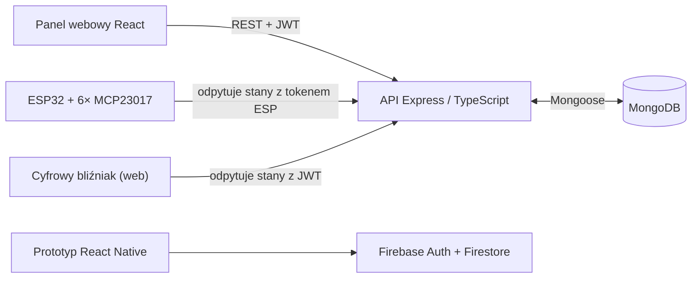

# Smart City Hub — dokumentacja techniczna

Skrócona dokumentacja systemu (wersja polska; wersja angielska: [DOCUMENTATION.md](DOCUMENTATION.md)). Instrukcje uruchomienia znajdują się w [README](../README.md).

## 1. Przegląd systemu

System składa się z czterech komponentów:

1. **API** (`source/server/api`) — centralny serwer REST w Node.js/Express/TypeScript. Przechowuje użytkowników, urządzenia, odczyty sensorów i historię stanów w MongoDB. Port domyślny: **4200**.
2. **Panel webowy** (`source/web/react`) — zależne od roli SPA w React do obsługi urządzeń, dostępnych lokalizacji, wykresów środowiskowych, historii stanów i zarządzania przez administratora.
3. **Firmware ESP32** (`source/embedded/esp32_arduino`) — odpytuje API o aktualne stany urządzeń i ustawia 96 wyjść cyfrowych przez ekspandery MCP23017.
4. **Aplikacja mobilna** (`source/mobile/react-native`) — React Native; miała być klientem wspólnego API Node.js, ale integracja nie została ukończona. Zachowany prototyp korzysta z Firebase (Auth + Firestore) jako niezależnego backendu.



Pierwotny plan zakładał integrację aplikacji mobilnej z systemem Node.js/MongoDB. Prace nie zostały ukończone, dlatego zachowana ścieżka mobilna/Firebase pozostaje niezależna, a jej dane nie są synchronizowane z głównym systemem.

Trzeci, wyłącznie do odczytu, klient — aplikacja webowa [Cyfrowy bliźniak](https://github.com/Kamilr616/smart-city-digital-twin) — odzwierciedla na ekranie fizyczną makietę LEGO. Znajduje się we własnym repozytorium i odpytuje `GET /api/state/iot/all` z tokenem JWT. Płytki ESP32 mogą korzystać z osobnych danych dostępowych ograniczonych do lokalizacji.

## 2. Uwierzytelnianie i role

- Logowanie: `POST /api/user/auth` zwraca token **JWT** (sekret: zmienna `JWT_SECRET_KEY`).
- Token przekazywany w nagłówku `Authorization: Bearer <token>` lub `x-access-token`.
- Hasła hashowane **bcrypt**, przechowywane w osobnej kolekcji (`password.schema.ts`); tokeny sesji w kolekcji tokenów (`token.schema.ts`).
- Middleware:
  - `auth.middleware` — wymaga poprawnego JWT (dostęp „user").
  - `admin.middleware` — wymaga JWT oraz roli `admin` / flagi `isAdmin`.
- Panel webowy przechowuje token w `sessionStorage`; zamknięcie karty przeglądarki usuwa lokalną sesję. API dodatkowo sprawdza, czy token nadal istnieje w kolekcji sesji po stronie serwera.

## 3. Modele danych (MongoDB / Mongoose)

| Model | Pola | Opis |
|---|---|---|
| **User** | `email` (unikalny), `name` (unikalny), `role` (domyślnie `user`), `active`, `isAdmin` | Konta użytkowników |
| **Password** | `userId`, `password` (hash bcrypt) | Hasła, osobno od użytkowników |
| **Token** | `userId`, `value` | Tokeny sesji |
| **EspToken** | `name`, `location`, `tokenHash`, `createdAt`, `expiresAt`, `revokedAt` | Wygasające i odwoływalne tokeny lokalizacji; tylko hash |
| **Device** | `deviceId` (Number), `location`, `name` (domyślnie `outlet`), `type`, `description`, `editDate` | Metadane urządzeń (maks. 96) |
| **DeviceState** | `deviceId` (ref: Device), `states[]` — `{state: Boolean, timestamp: Date}` | Historia włączeń/wyłączeń |
| **Sensor** | `deviceId`, `temperature`, `pressure`, `humidity`, `readingDate` | Odczyty sensorów |

## 4. Endpointy API

Prefiks wszystkich tras: `/api`. Oznaczenia: 🔓 publiczny, 👤 wymaga JWT, 🛡️ wymaga roli admin.

### Użytkownicy — `/api/user`

| Metoda | Ścieżka | Dostęp | Opis |
|---|---|---|---|
| GET | `/list` | 🛡️ | Lista kont użytkowników |
| PATCH | `/:id` | 🛡️ | Edycja konta i unieważnienie jego sesji |
| POST | `/create` | 🛡️ | Utworzenie użytkownika |
| POST | `/auth` | 🔓 | Logowanie, zwraca JWT |
| DELETE | `/logout` | 👤 | Wylogowanie i unieważnienie bieżącego tokenu |

### Urządzenia — `/api/device`

| Metoda | Ścieżka | Dostęp | Opis |
|---|---|---|---|
| GET | `/latest` | 🛡️ | Najnowsze dane urządzeń |
| GET | `/get/:location` | 🛡️ | Urządzenia wg lokalizacji |
| GET | `/user/get` | 👤 | Urządzenia przypisane do zalogowanego użytkownika |
| GET | `/all/:id` | 🛡️ | Wszystkie wpisy dla urządzenia |
| GET | `/:id` | 🛡️ | Pojedyncze urządzenie |
| POST | `/update` | 🛡️ | Dodanie / aktualizacja urządzenia |
| PATCH | `/:id` | 🛡️ | Edycja metadanych bez zmiany ID ani historii stanów |
| DELETE | `/all` | 🛡️ | Usunięcie wszystkich urządzeń |
| DELETE | `/:id` | 🛡️ | Usunięcie urządzenia |

### Stany urządzeń — `/api/state`

| Metoda | Ścieżka | Dostęp | Opis |
|---|---|---|---|
| GET | `/iot/all` | 👤 lub ESP | 96 stanów ograniczonych do roli/lokalizacji; JWT admina może odczytać wszystkie |
| GET | `/user/latest` | 👤 | Najnowsze stany urządzeń użytkownika |
| GET | `/history/:id` | 👤 | Historia stanów uprawnionego urządzenia w zadanym czasie |
| GET | `/latest` | 🛡️ | Najnowsze stany (wszystkie) |
| GET | `/all` | 🛡️ | Pełna historia stanów |
| GET | `/:id` | 🛡️ | Stan konkretnego urządzenia |
| POST | `/user/update` | 👤 | Zmiana stanu urządzenia przez użytkownika |
| POST | `/update`, `/update/:id` | 🛡️ | Zmiana stanu przez administratora |
| DELETE | `/all`, `/:id` | 🛡️ | Usunięcie historii stanów |

### Sensory — `/api/sensor`

| Metoda | Ścieżka | Dostęp | Opis |
|---|---|---|---|
| GET | `/all/latest` | 🔓 | Najnowsze odczyty wszystkich sensorów |
| GET | `/history/:id` | 👤 | Historia temperatury, wilgotności i ciśnienia w zadanym czasie |
| GET | `/all` | 🔓 | Najnowsze 20 odczytów każdego skonfigurowanego sensora |
| GET | `/all/:num` | 🛡️ | Ostatnie dodatnie *num* odczytów każdego skonfigurowanego sensora |
| GET | `/:id` | 🛡️ | Odczyty sensora |
| POST | `/iot/update` | 🛡️ lub ESP | Zbiorczy zapis; ESP tylko dla zarejestrowanych czujników swojej lokalizacji |
| POST | `/update/:id` | 🛡️ | Aktualizacja odczytu |
| DELETE | `/all`, `/:id` | 🛡️ | Usunięcie odczytów |

Obie trasy historii wymagają zweryfikowanego JWT, który nadal znajduje się w magazynie tokenów. Parametry query `from` i `to` są znacznikami czasu ISO ze strefą czasową; zakres musi być dodatni i nie może przekraczać 31 dni. Ich pominięcie wybiera poprzednie 24 godziny. `limit` przyjmuje 1–2000, domyślnie 1000. Wyniki są chronologiczne i zawierają `truncated`, gdy istnieją dalsze pasujące obserwacje.

Historia stanów dodatkowo autoryzuje urządzenie według lokalizacji: rola zwykłego użytkownika musi odpowiadać `Device.location`, a administrator może odczytać każde urządzenie. Dostęp administratora uznaje zarówno `role: admin`, jak i obsługiwany claim `isAdmin`. Pole `initialState` zawiera ostatni zapisany stan sprzed `from` albo `null`, gdy stan jest nieznany. Przy skróconym wyniku klient nie może łączyć pominiętego okresu z tym stanem bazowym.

### Operacje administratora

`GET /api/user/list` zwraca tablicę `{_id, name, email, role, isAdmin, active}` bez haseł i tokenów sesji. `PATCH /api/user/:id` przyjmuje co najmniej jedno z pól `name`, `email`, `role`, `isAdmin`, `active`, `password`; `:id` to identyfikator MongoDB użytkownika. Nazwa i rola to niepuste ciągi do 100 znaków, e-mail do 254 znaków, a flagi mają typ boolean. Nieznane pola są odrzucane. Hasło wymaga co najmniej 12 znaków i najwyżej 72 bajtów UTF-8; pominięcie `password` zachowuje istniejący hash.

Każda udana edycja konta unieważnia wszystkie jego sesje. Zapis hasła, zmiany konta i unieważnienie sesji działają w transakcji MongoDB, więc aktualizacja kont wymaga MongoDB Atlas albo replica set, a nie pojedynczego serwera standalone. Nieaktywne konto nie może się logować ani używać istniejących sesji. Odebranie sobie dostępu administracyjnego, dezaktywacja własnego konta lub usunięcie ostatniego aktywnego administratora jest odrzucane kodem 409. Powtórzona nazwa/e-mail również zwraca 409, błędne dane 400, a brak konta 404.

`PATCH /api/device/:id` zmienia wyłącznie `name`, `type`, `description` i `location`; `:id` to numeryczny identyfikator urządzenia (0–95). Pole `deviceId` jest niezmienne. Edycja metadanych zachowuje historię stanów i aktualizuje `editDate`; przeniesienie urządzenia zmienia lokalizację mającą do niego dostęp.

### Tokeny ESP — `/api/esp-tokens`

| Metoda | Ścieżka | Dostęp | Opis |
|---|---|---|---|
| GET | `/` | 🛡️ | Lista metadanych bez wartości tokenów i hashy |
| POST | `/` | 🛡️ | Utworzenie tokenu lokalizacji; wartość zwracana tylko raz |
| DELETE | `/:id` | 🛡️ | Unieważnienie według identyfikatora MongoDB tokenu |

Tworzenie przyjmuje `{name, location, expiresInDays}`: nazwa i lokalizacja są niepustymi ciągami do 120 znaków; ważność jest liczbą całkowitą od 1 do 365 dni. Lokalizacja musi występować w metadanych urządzeń lub katalogu czujników; `admin` i `*` nie są dozwolonym zakresem. Odpowiedź 201 to `{token, key}`, gdzie `key` zawiera `{id, name, location, createdAt, expiresAt, revokedAt}`. Lista zwraca tablicę tych metadanych, a unieważnienie zaktualizowany obiekt. Brak daty unieważnienia oznacza `null`.

Nieprzezroczysty token składa się z prefiksu `sch_` i 64 losowych znaków szesnastkowych. MongoDB przechowuje wyłącznie jego hash SHA-256. Wartość trzeba skopiować przy tworzeniu: później nie można jej odzyskać. Token wygasły lub unieważniony zwraca 401. Nieznany identyfikator tokenu podczas unieważniania zwraca 404, a błędne dane 400.

Tokeny ESP są przyjmowane wyłącznie przez `GET /api/state/iot/all` i `POST /api/sensor/iot/update`, w nagłówku `Authorization: Bearer <token>` albo dotychczasowym `x-access-token: Bearer <token>`. Nie uwierzytelniają tras panelu ani ogólnych operacji administratora. Trasa stanów zachowuje tablicę 96 elementów indeksowaną przez `deviceId`; brakujące urządzenia i każde urządzenie spoza lokalizacji tokenu otrzymują `false`. JWT zwykłego użytkownika również ogranicza odczyt do jego roli/lokalizacji; JWT administratora może odczytać wszystkie lokalizacje.

Zapis pomiarów zachowuje body `{sensorData: [{deviceId, air: {temperature, pressure, humidity}}]}`. Każdy czujnik w partii ESP musi być zarejestrowany w lokalizacji tokenu; obca lokalizacja albo niezarejestrowany czujnik odrzuca całą partię kodem 403 przed zapisem. Nadal można wysyłać pomiary z JWT administratora. Zachowany szkic sterujący wyjściami jedynie odpytuje stany; wysyłanie pomiarów wymaga firmware czujnika.

## 5. Panel webowy — przepływ

1. `Login.jsx` → `POST /api/user/auth` → token JWT jest zapisywany dla bieżącej karty w `sessionStorage`; trasy chronione odrzucają wygasłe sesje.
2. `PanelLayout` co 30 sekund pobiera urządzenia, najnowsze stany, definicje czujników i najnowsze odczyty. Zwykłe konto widzi urządzenia i czujniki swojej roli/lokalizacji, a administrator wszystkie.
3. `Devices` zastępuje dawny widok `Home Lights`. Filtruje urządzenia, aktualizuje przypisane stany przez `POST /api/state/user/update` i otwiera historię urządzenia z `GET /api/state/history/:id`.
4. `Locations` powstaje z lokalizacji urządzeń i czujników dostępnych dla konta, bez osobnego magazynu lokalizacji.
5. Wykresy czujników pobierają `GET /api/sensor/history/:id` dla temperatury, wilgotności i ciśnienia z 1 godziny, 24 godzin, 7 dni lub 30 dni. Domyślnie pokazują dane rzeczywiste. Opcjonalny tryb DEMO jest początkowo wyłączony i tworzy próbki wyłącznie w pamięci przeglądarki; nie wywołuje trasy zapisu.

6. Administrator używa widoku `Users` do listowania i edycji kont, `Devices` do edycji metadanych urządzeń oraz `ESP tokens` do tworzenia tokenów, sprawdzania ważności i unieważniania. Wartość tokenu pojawia się tylko raz po utworzeniu. Interfejs zachowuje pierwotną białą i szarą paletę, niebieską nawigację, czarne przyciski, logo KI i krótkie nagłówki.

Wykresy zachowują brakujące wartości zamiast wymyślać pomiary. Stan urządzenia sprzed pierwszej zapisanej obserwacji pozostaje nieznany, a skrócona historia pozostawia pusty pominięty okres początkowy. Rejestracja czujnika tworzy tylko metadane: bez podłączonego ESP nie pojawią się prawdziwe odczyty.

## 6. Firmware ESP32

- **Sprzęt:** ESP32 + 6× MCP23017 na magistrali I2C (adresy `0x22`–`0x27`), łącznie 96 wyjść; SDA=21, SCL=22; UART 9600 baud.
- **Działanie:** po połączeniu z WiFi szkic cyklicznie wykonuje `GET /api/state/iot/all` (z tokenem w nagłówku `x-access-token`), parsuje dokładnie 96-elementową tablicę stanów JSON (`ArduinoJson`) i zapisuje potrzebne rejestry MCP23017 bezpośrednio przez I2C. Pozycja w tablicy odpowiada `deviceId`, a brakujące urządzenia i urządzenia spoza lokalizacji tokenu są reprezentowane przez `false`.
- **Konfiguracja:** skopiuj `secrets.example.h` do ignorowanego pliku `secrets.h`, a następnie ustaw SSID WiFi, adres API oraz `API_TOKEN` przed wgraniem firmware. Utwórz token w `ESP tokens` i wpisz `"Bearer "` oraz pełną wartość `sch_...`. Dotychczasowy szkic wysyła ten ciąg przez `x-access-token`; wygaśnięcie lub unieważnienie wymaga nowego tokenu i ponownego wgrania firmware.

### 6.1 Historyczne materiały NXP/LPCXpresso

Poniższe oficjalne materiały NXP zebrano podczas prac badawczych nad projektem. Dotyczą platformy LPCXpresso55S69/MCUXpresso i nie są wymagane do zbudowania firmware Smart City Hub opartego na ESP32:

- [Dokumentacja MCUXpresso SDK dla LPCXpresso55S69](https://mcuxpresso.nxp.com/mcuxsdk/latest/html/boards/LPC/lpcxpresso55s69/index.html) — opis płytki i indeks dokumentacji
- [Pierwsze kroki z pakietem MCUXpresso SDK](https://mcuxpresso.nxp.com/mcuxsdk/latest/html/gsd/package.html)
- [Informacje o wydaniu MCUXpresso SDK dla LPCXpresso55S69](https://mcuxpresso.nxp.com/mcuxsdk/latest/html/boards/LPC/lpcxpresso55s69/releaseNotes/rnindex.html)
- [Historia zmian MCUXpresso SDK dla LPCXpresso55S69](https://mcuxpresso.nxp.com/mcuxsdk/latest/html/boards/LPC/lpcxpresso55s69/changeLog/clindex.html)
- [Dokumentacja API sterowników LPC55S69](https://mcuxpresso.nxp.com/mcuxsdk/latest/html/drivers/LPC/LPC5500/LPC55S69/index.html)
- [FreeRTOS w MCUXpresso SDK](https://mcuxpresso.nxp.com/mcuxsdk/latest/html/rtos/freertos/index.html)
- [Strona płytki LPCXpresso55S69 i dokument UM11158](https://www.nxp.com/design/design-center/software/development-software/mcuxpresso-software-and-tools-/lpcxpresso-boards/lpcxpresso55s69-development-board%3ALPC55S69-EVK)

## 7. Konfiguracja środowiska

| Komponent | Zmienna | Opis |
|---|---|---|
| API | `PORT` | Port serwera (domyślnie 4200) |
| API | `JWT_SECRET_KEY` | Sekret do podpisywania JWT |
| API | `MONGODB_URI` | Connection string MongoDB Atlas |
| API | `CORS_ORIGIN` | Lista dozwolonych źródeł panelu webowego, rozdzielona przecinkami (domyślnie `http://localhost:5173`) |
| Seed API | `INITIAL_ADMIN_EMAIL` | E-mail używany wyłącznie przez `npm run seed:admin` |
| Seed API | `INITIAL_ADMIN_NAME` | Nazwa logowania używana wyłącznie przez `npm run seed:admin` |
| Seed API | `INITIAL_ADMIN_PASSWORD` | Hasło początkowe (minimum 12 znaków); usuń je po seedowaniu |
| Web | `VITE_API_URL` | Bazowy adres API z końcowym `/api` lub bez; oba warianty są normalizowane |
| Mobile | `firebaseConfig.local.ts` | Lokalna konfiguracja Firebase skopiowana z wersjonowanego szablonu |
| Firmware | `secrets.h` | Lokalne SSID Wi-Fi, adres API i token skopiowane z `secrets.example.h` |

Przed uruchomieniem komponentu skopiuj właściwy wersjonowany plik `.env.example` do `.env`. Dla nowej bazy MongoDB uruchom jednorazowo `npm run seed:admin` w `source/server/api`. Polecenie nie nadpisuje istniejącego użytkownika powodującego konflikt i można je bezpiecznie uruchomić ponownie dla kompletnego administratora.

Pliki `.env` nie są wersjonowane (`.gitignore`). Nigdy nie commituj początkowego hasła administratora.

## 8. Uruchamianie API i wdrożenie na Vercelu

API ma dwa punkty wejścia o różnych zadaniach:

- `source/server/api/lib/index.ts` jest lokalnym punktem wejścia procesu. Łączy się z MongoDB, uruchamia `app.listen()` na porcie `PORT` i obsługuje sygnały procesu.
- `source/server/api/api/index.ts` jest punktem wejścia Vercela. Eksportuje jako domyślny handler współdzieloną aplikację Express utworzoną przez `lib/createApp.ts`; sam import nie otwiera portu, nie łączy z MongoDB ani nie rejestruje obsługi sygnałów procesu.

Dla żądań serverless plik `lib/database.ts` nawiązuje połączenie leniwie i przechowuje trwającą próbę połączenia w cache jednej ciepłej instancji funkcji. Gotowe połączenie Mongoose jest używane ponownie, a po nieudanej próbie lub rozłączeniu możliwe jest ponowienie. `serverSelectionTimeoutMS` wynosi 5 sekund; ogranicza wybór serwera, a nie czas każdego zapytania do bazy.

Kolejność obsługi żądania to middleware CORS, middleware bazy, a następnie kontrolery. Dzięki temu preflight CORS kończy się przed próbą połączenia z bazą. Gdy MongoDB jest niedostępne, trasy API zwracają ogólną odpowiedź JSON 503 z błędem `Database unavailable`, bez ujawniania URI ani surowego błędu sterownika.

### Konfiguracja Vercela

| Ustawienie | Wartość |
|---|---|
| Root Directory | `source/server/api` |
| Framework Preset | Other |
| Install Command | `npm ci` |
| Build Command | `npm run typecheck && npm run build` |
| Output Directory | `dist/public` |

Katalog outputu zawiera wyłącznie stronę statyczną. Funkcja serverless powstaje z `api/index.ts`, a `vercel.json` przepisuje `/api/:path*` na `/api`, zachowując dla Express ścieżkę, metodę, query i body. Statyczna strona startowa `/` pozostaje niezależna od dostępności bazy.

Ustaw `JWT_SECRET_KEY`, `MONGODB_URI` i `CORS_ORIGIN` w środowiskach Preview i Production. `PORT` służy tylko lokalnie. Skonfiguruj dostęp sieciowy MongoDB Atlas dla faktycznego egressu wdrożenia Vercel; nie zakładaj, że nieograniczony dostęp `0.0.0.0/0` jest wymagany.

### Weryfikacja i diagnostyka

W katalogu głównym repozytorium uruchom (podczas łączenia wybierz projekt API):

```bash
npm --prefix source/server/api test
vercel link
vercel pull --yes --environment=preview
vercel build --local-config source/server/api/vercel.json
```

Polecenia CLI Vercela uruchamiaj z katalogu głównego repozytorium: CLI sam uwzględnia Root Directory projektu (`source/server/api`). Uruchomienie `vercel build --local-config source/server/api/vercel.json` wewnątrz katalogu backendu powoduje podwojenie tej ścieżki.

`npm test` obejmuje typecheck, build, regresje tras, testy współdzielenia i ponawiania połączenia z bazą, pasywny import handlera serverless, preflight CORS, odpowiedzi przy awarii bazy oraz logowanie bcrypt z wydaniem i unieważnieniem JWT. Wynik gotowy do wdrożenia wymaga też sprawdzenia `.vercel/output/functions` i `.vercel/output/config.json`, a następnie testów dymnych pod rzeczywistym URL-em Preview. Sprawdź co najmniej `GET /` (200 ze statycznym HTML-em nawet bez bazy) i `GET /api/state/iot/all` bez tokenu (aplikacyjne 401, gdy baza jest dostępna). Nie commituj `.vercel` ani pobranych plików środowiskowych.

404 platformy Vercel oznacza, że funkcja nie została wykryta albo rewrite do niej nie dotarł. Expressowe 404 dla nieznanej trasy API dowodzi wykonania funkcji, podobnie jak oczekiwane 401 z chronionego endpointu bez tokenu przy dostępnej bazie. Ogólna odpowiedź JSON 503 z błędem `Database unavailable` dowodzi wykonania funkcji i nieudanego połączenia z bazą. Lokalne testy handlera nie sprawdzają routingu Vercela, dlatego wymagane są artefakty builda i testy dymne Preview.

## 9. Znane ograniczenia / uwagi

- Sprzęt obsługuje identyfikatory 0–95 (6 ekspanderów × 16 wyjść). API wymusza ten zakres i unikalność identyfikatorów oraz zwraca deterministyczną, 96-elementową odpowiedź dla ESP32.
- Testy regresji API obejmują trasy, autoryzację, walidację historii, odpowiedź dla ESP32, współdzielenie i ponawianie połączenia z bazą oraz zachowanie serverless. W `source/web/react` polecenie `npm test` sprawdza pomocniczą obsługę URL-i, sesji i danych wykresów, a `npm run test:e2e` testuje panel w Playwright z mockowanym API; te testy przeglądarkowe nie zapisują danych w prawdziwym backendzie. Projekt mobilny zachowuje jeden test dymny renderowania React Native. Brak konfiguracji Docker/CI.
- Projekty webowy i mobilny przechodzą zadania ESLint; przechodzi również sprawdzenie TypeScript aplikacji mobilnej.
- Dane konfiguracyjne firmware są dostarczane przez ignorowany plik `secrets.h`; ich zmiana nadal wymaga rekompilacji.
- Planowana integracja aplikacji mobilnej z API Node.js nie została ukończona. Zachowany prototyp używa Firebase, a oba backendy nie są zsynchronizowane.
- Dla prototypu mobilnego zachowano tylko natywny projekt iOS; jego zbudowanie wymaga macOS z Xcode. Repozytorium nie zawiera natywnego projektu Android.
- `npm audit` nadal zgłasza ostrzeżenie poziomu moderate w drzewie zależności starszego CLI React Native 0.73. Automatyczna poprawka proponowana przez npm wymaga niekompatybilnej aktualizacji React Native i powinna być osobną migracją.
- Zainstalowano pakiety klienta/core GraphQL, ale nie ma aktywnego schematu ani endpointu GraphQL; zaimplementowanym interfejsem jest REST.

## 10. Licencje

Kod i dokumentacja autorstwa zespołu projektu są objęte repozytoryjną [licencją MIT](../LICENSE). Dołączone biblioteki, multimedia, instrukcje i zależności pakietów zachowują własne warunki; zobacz [informacje o licencjach podmiotów trzecich](THIRD_PARTY_NOTICES.md).

## Katalog czujników LEGO

Dwa planowane czujniki środowiskowe opisano w
[lego-sensors.json](../source/server/api/scripts/lego-sensors.json): stacja pogodowa przy
ulicy (ID czujnika 0) i czujnik przy Corner Garage (ID 1).
API udostępnia nazwy, opisy, lokalizację i jednostki przez
`GET /api/sensor/catalog`. Administrator rejestruje lub aktualizuje definicję przez
`POST /api/sensor/catalog`, podając `deviceId`, `name`, `description` i `location`.

Definicje mają osobną kolekcję, niezależną od odczytów i urządzeń wykonawczych.
Rejestracja nie tworzy pomiarów: bez danych z ESP endpoint najnowszych odczytów nadal
zwraca puste miejsca czujników. Symulacja Digital Twin działa w przeglądarce.
Chroniona trasa zbiorczego zapisu pomiarów przyjmuje ID czujników 0 i 1.

Odczyt katalogu jest publiczny, podobnie jak odczyt najnowszych pomiarów. Zapis wymaga
dotychczasowej weryfikacji JWT, kontroli magazynu tokenów oraz uprawnień administratora.
POST aktualizuje lub tworzy wpis według ID czujnika (0–1). Nazwa i lokalizacja są
wymaganymi niepustymi ciągami do 120 znaków, opis może mieć do 1000 znaków.
Pola pomiarowe i nieznane właściwości są odrzucane. Rejestracja nie zmienia stanów włącz/wyłącz.
Odpowiedź zawiera `type: "environmental"` i `measurements`: temperature/°C, humidity/%
oraz pressure/hPa. Niepoprawna definicja zwraca 400, a błąd zapisu 503.
Ponowna rejestracja aktualizuje metadane zamiast tworzyć duplikaty.
