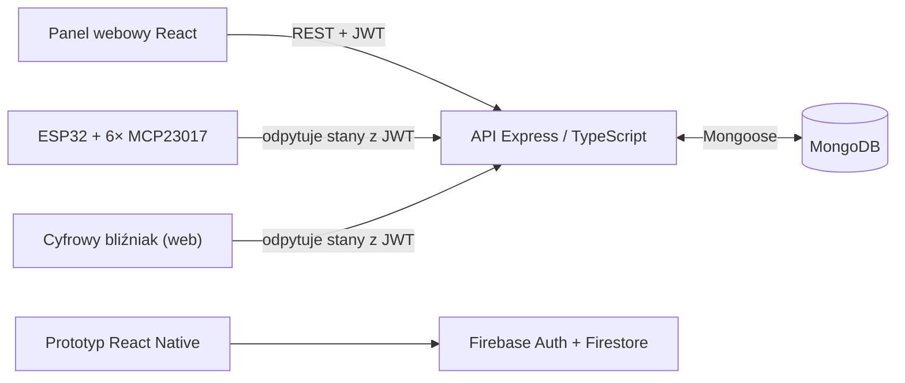

# Smart City Hub — dokumentacja techniczna

Skrócona dokumentacja systemu (wersja polska; wersja angielska: [DOCUMENTATION.md](DOCUMENTATION.md)). Instrukcje uruchomienia znajdują się w [README](../README.md).

## 1. Przegląd systemu

System składa się z czterech komponentów:

1. **API** (`source/server/api`) — centralny serwer REST w Node.js/Express/TypeScript. Przechowuje użytkowników, urządzenia, odczyty sensorów i historię stanów w MongoDB. Port domyślny: **4200**.
2. **Panel webowy** (`source/web/react`) — SPA w React; osobne widoki dla administratora (zarządzanie użytkownikami i urządzeniami) i użytkownika (sterowanie przypisanymi urządzeniami).
3. **Firmware ESP32** (`source/embedded/esp32_arduino`) — odpytuje API o aktualne stany urządzeń i ustawia 96 wyjść cyfrowych przez ekspandery MCP23017.
4. **Aplikacja mobilna** (`source/mobile/react-native`) — React Native; miała być klientem wspólnego API Node.js, ale integracja nie została ukończona. Zachowany prototyp korzysta z Firebase (Auth + Firestore) jako niezależnego backendu.



Pierwotny plan zakładał integrację aplikacji mobilnej z systemem Node.js/MongoDB. Prace nie zostały ukończone, dlatego zachowana ścieżka mobilna/Firebase pozostaje niezależna, a jej dane nie są synchronizowane z głównym systemem.

Trzeci, wyłącznie do odczytu, klient — aplikacja webowa [Cyfrowy bliźniak](https://github.com/Kamilr616/smart-city-digital-twin) — odzwierciedla na ekranie fizyczną makietę LEGO. Odpytuje `GET /api/state/iot/all` z tokenem JWT dokładnie tak samo jak firmware ESP32 i znajduje się we własnym repozytorium.

## 2. Uwierzytelnianie i role

- Logowanie: `POST /api/user/auth` zwraca token **JWT** (sekret: zmienna `JWT_SECRET_KEY`).
- Token przekazywany w nagłówku `Authorization: Bearer <token>` lub `x-access-token`.
- Hasła hashowane **bcrypt**, przechowywane w osobnej kolekcji (`password.schema.ts`); tokeny sesji w kolekcji tokenów (`token.schema.ts`).
- Middleware:
  - `auth.middleware` — wymaga poprawnego JWT (dostęp „user").
  - `admin.middleware` — wymaga JWT oraz roli `admin` / flagi `isAdmin`.
- Panel webowy przechowuje token w `sessionStorage`; zamknięcie karty przeglądarki usuwa lokalną sesję. API dodatkowo sprawdza, czy token nadal istnieje w kolekcji sesji po stronie serwera.

## 3. Modele danych (MongoDB / Mongoose)

| Model | Pola | Opis |
|---|---|---|
| **User** | `email` (unikalny), `name` (unikalny), `role` (domyślnie `user`), `active`, `isAdmin` | Konta użytkowników |
| **Password** | `userId`, `password` (hash bcrypt) | Hasła, osobno od użytkowników |
| **Token** | `userId`, `value` | Tokeny sesji |
| **Device** | `deviceId` (Number), `location`, `name` (domyślnie `outlet`), `type`, `description`, `editDate` | Metadane urządzeń (maks. 96) |
| **DeviceState** | `deviceId` (ref: Device), `states[]` — `{state: Boolean, timestamp: Date}` | Historia włączeń/wyłączeń |
| **Sensor** | `deviceId`, `temperature`, `pressure`, `humidity`, `readingDate` | Odczyty sensorów |

## 4. Endpointy API

Prefiks wszystkich tras: `/api`. Oznaczenia: 🔓 publiczny, 👤 wymaga JWT, 🛡️ wymaga roli admin.

### Użytkownicy — `/api/user`

| Metoda | Ścieżka | Dostęp | Opis |
|---|---|---|---|
| POST | `/create` | 🛡️ | Utworzenie użytkownika |
| POST | `/auth` | 🔓 | Logowanie, zwraca JWT |
| DELETE | `/logout` | 👤 | Wylogowanie i unieważnienie bieżącego tokenu |

### Urządzenia — `/api/device`

| Metoda | Ścieżka | Dostęp | Opis |
|---|---|---|---|
| GET | `/latest` | 🛡️ | Najnowsze dane urządzeń |
| GET | `/get/:location` | 🛡️ | Urządzenia wg lokalizacji |
| GET | `/user/get` | 👤 | Urządzenia przypisane do zalogowanego użytkownika |
| GET | `/all/:id` | 🛡️ | Wszystkie wpisy dla urządzenia |
| GET | `/:id` | 🛡️ | Pojedyncze urządzenie |
| POST | `/update` | 🛡️ | Dodanie / aktualizacja urządzenia |
| DELETE | `/all` | 🛡️ | Usunięcie wszystkich urządzeń |
| DELETE | `/:id` | 🛡️ | Usunięcie urządzenia |

### Stany urządzeń — `/api/state`

| Metoda | Ścieżka | Dostęp | Opis |
|---|---|---|---|
| GET | `/iot/all` | 👤 | Aktualne stany wszystkich urządzeń — używane przez ESP32 |
| GET | `/user/latest` | 👤 | Najnowsze stany urządzeń użytkownika |
| GET | `/latest` | 🛡️ | Najnowsze stany (wszystkie) |
| GET | `/all` | 🛡️ | Pełna historia stanów |
| GET | `/:id` | 🛡️ | Stan konkretnego urządzenia |
| POST | `/user/update` | 👤 | Zmiana stanu urządzenia przez użytkownika |
| POST | `/update`, `/update/:id` | 🛡️ | Zmiana stanu przez administratora |
| DELETE | `/all`, `/:id` | 🛡️ | Usunięcie historii stanów |

### Sensory — `/api/sensor`

| Metoda | Ścieżka | Dostęp | Opis |
|---|---|---|---|
| GET | `/all/latest` | 🔓 | Najnowsze odczyty wszystkich sensorów |
| GET | `/all` | 🔓 | Najnowsze 20 odczytów każdego skonfigurowanego sensora |
| GET | `/all/:num` | 🛡️ | Ostatnie dodatnie *num* odczytów każdego skonfigurowanego sensora |
| GET | `/:id` | 🛡️ | Odczyty sensora |
| POST | `/iot/update` | 🛡️ | Walidacja i zbiorczy zapis odczytów sensorów |
| POST | `/update/:id` | 🛡️ | Aktualizacja odczytu |
| DELETE | `/all`, `/:id` | 🛡️ | Usunięcie odczytów |

## 5. Panel webowy — przepływ

1. `Login.jsx` → `POST /api/user/auth` → token JWT zapisywany dla bieżącej karty w `sessionStorage`.
2. Router (`App.jsx`) kieruje na podstawie roli: `Dashboard` (user) lub `AdminDashboard` (admin); trasy chronione przez `PrivateRoutes`.
3. Użytkownik: `UsersTable` pobiera urządzenia z `GET /api/device/user/get` i przełącza stany przez `POST /api/state/user/update`.
4. Administrator: zakładki *addNewUser* (`POST /api/user/create`), *addNewDevice* (`POST /api/device/update`) oraz *controlPanel* (`AdminsTable` — sterowanie wszystkimi urządzeniami).

## 6. Firmware ESP32

- **Sprzęt:** ESP32 + 6× MCP23017 na magistrali I2C (adresy `0x22`–`0x27`), łącznie 96 wyjść; SDA=21, SCL=22; UART 9600 baud.
- **Działanie:** po połączeniu z WiFi szkic cyklicznie wykonuje `GET /api/state/iot/all` (z tokenem w nagłówku `x-access-token`), parsuje dokładnie 96-elementową tablicę stanów JSON (`ArduinoJson`) i zapisuje potrzebne rejestry MCP23017 bezpośrednio przez I2C. Pozycja w tablicy odpowiada `deviceId`, a brakujące urządzenia są reprezentowane przez `false`.
- **Konfiguracja:** skopiuj `secrets.example.h` do ignorowanego pliku `secrets.h`, a następnie ustaw SSID WiFi, adres API oraz token bearer przed wgraniem firmware.

### 6.1 Historyczne materiały NXP/LPCXpresso

Poniższe oficjalne materiały NXP zebrano podczas prac badawczych nad projektem. Dotyczą platformy LPCXpresso55S69/MCUXpresso i nie są wymagane do zbudowania firmware Smart City Hub opartego na ESP32:

- [Dokumentacja MCUXpresso SDK dla LPCXpresso55S69](https://mcuxpresso.nxp.com/mcuxsdk/latest/html/boards/LPC/lpcxpresso55s69/index.html) — opis płytki i indeks dokumentacji
- [Pierwsze kroki z pakietem MCUXpresso SDK](https://mcuxpresso.nxp.com/mcuxsdk/latest/html/gsd/package.html)
- [Informacje o wydaniu MCUXpresso SDK dla LPCXpresso55S69](https://mcuxpresso.nxp.com/mcuxsdk/latest/html/boards/LPC/lpcxpresso55s69/releaseNotes/rnindex.html)
- [Historia zmian MCUXpresso SDK dla LPCXpresso55S69](https://mcuxpresso.nxp.com/mcuxsdk/latest/html/boards/LPC/lpcxpresso55s69/changeLog/clindex.html)
- [Dokumentacja API sterowników LPC55S69](https://mcuxpresso.nxp.com/mcuxsdk/latest/html/drivers/LPC/LPC5500/LPC55S69/index.html)
- [FreeRTOS w MCUXpresso SDK](https://mcuxpresso.nxp.com/mcuxsdk/latest/html/rtos/freertos/index.html)
- [Strona płytki LPCXpresso55S69 i dokument UM11158](https://www.nxp.com/design/design-center/software/development-software/mcuxpresso-software-and-tools-/lpcxpresso-boards/lpcxpresso55s69-development-board%3ALPC55S69-EVK)

## 7. Konfiguracja środowiska

| Komponent | Zmienna | Opis |
|---|---|---|
| API | `PORT` | Port serwera (domyślnie 4200) |
| API | `JWT_SECRET_KEY` | Sekret do podpisywania JWT |
| API | `MONGODB_URI` | Connection string MongoDB Atlas |
| API | `CORS_ORIGIN` | Lista dozwolonych źródeł panelu webowego, rozdzielona przecinkami (domyślnie `http://localhost:5173`) |
| Seed API | `INITIAL_ADMIN_EMAIL` | E-mail używany wyłącznie przez `npm run seed:admin` |
| Seed API | `INITIAL_ADMIN_NAME` | Nazwa logowania używana wyłącznie przez `npm run seed:admin` |
| Seed API | `INITIAL_ADMIN_PASSWORD` | Hasło początkowe (minimum 12 znaków); usuń je po seedowaniu |
| Web | `VITE_API_URL` | Adres API, np. `http://localhost:4200/api` |
| Mobile | `firebaseConfig.local.ts` | Lokalna konfiguracja Firebase skopiowana z wersjonowanego szablonu |
| Firmware | `secrets.h` | Lokalne SSID Wi-Fi, adres API i token skopiowane z `secrets.example.h` |

Przed uruchomieniem komponentu skopiuj właściwy wersjonowany plik `.env.example` do `.env`. Dla nowej bazy MongoDB uruchom jednorazowo `npm run seed:admin` w `source/server/api`. Polecenie nie nadpisuje istniejącego użytkownika powodującego konflikt i można je bezpiecznie uruchomić ponownie dla kompletnego administratora.

Pliki `.env` nie są wersjonowane (`.gitignore`). Nigdy nie commituj początkowego hasła administratora.

## 8. Uruchamianie API i wdrożenie na Vercelu

API ma dwa punkty wejścia o różnych zadaniach:

- `source/server/api/lib/index.ts` jest lokalnym punktem wejścia procesu. Łączy się z MongoDB, uruchamia `app.listen()` na porcie `PORT` i obsługuje sygnały procesu.
- `source/server/api/api/index.ts` jest punktem wejścia Vercela. Eksportuje jako domyślny handler współdzieloną aplikację Express utworzoną przez `lib/createApp.ts`; sam import nie otwiera portu, nie łączy z MongoDB ani nie rejestruje obsługi sygnałów procesu.

Dla żądań serverless plik `lib/database.ts` nawiązuje połączenie leniwie i przechowuje trwającą próbę połączenia w cache jednej ciepłej instancji funkcji. Gotowe połączenie Mongoose jest używane ponownie, a po nieudanej próbie lub rozłączeniu możliwe jest ponowienie. `serverSelectionTimeoutMS` wynosi 5 sekund; ogranicza wybór serwera, a nie czas każdego zapytania do bazy.

Kolejność obsługi żądania to middleware CORS, middleware bazy, a następnie kontrolery. Dzięki temu preflight CORS kończy się przed próbą połączenia z bazą. Gdy MongoDB jest niedostępne, trasy API zwracają ogólną odpowiedź JSON 503 z błędem `Database unavailable`, bez ujawniania URI ani surowego błędu sterownika.

### Konfiguracja Vercela

| Ustawienie | Wartość |
|---|---|
| Root Directory | `source/server/api` |
| Framework Preset | Other |
| Install Command | `npm ci` |
| Build Command | `npm run typecheck && npm run build` |
| Output Directory | `dist/public` |

Katalog outputu zawiera wyłącznie stronę statyczną. Funkcja serverless powstaje z `api/index.ts`, a `vercel.json` przepisuje `/api/:path*` na `/api`, zachowując dla Express ścieżkę, metodę, query i body. Statyczna strona startowa `/` pozostaje niezależna od dostępności bazy.

Ustaw `JWT_SECRET_KEY`, `MONGODB_URI` i `CORS_ORIGIN` w środowiskach Preview i Production. `PORT` służy tylko lokalnie. Skonfiguruj dostęp sieciowy MongoDB Atlas dla faktycznego egressu wdrożenia Vercel; nie zakładaj, że nieograniczony dostęp `0.0.0.0/0` jest wymagany.

### Weryfikacja i diagnostyka

W katalogu głównym repozytorium uruchom (podczas łączenia wybierz projekt API):

```bash
npm --prefix source/server/api test
vercel link
vercel pull --yes --environment=preview
vercel build
```

Polecenia CLI Vercela uruchamiaj z katalogu głównego repozytorium: CLI sam uwzględnia Root Directory projektu (`source/server/api`). Uruchomienie `vercel build` wewnątrz katalogu backendu powoduje podwojenie tej ścieżki.

`npm test` obejmuje typecheck, build, regresje tras, testy współdzielenia i ponawiania połączenia z bazą, pasywny import handlera serverless, preflight CORS, odpowiedzi przy awarii bazy oraz logowanie bcrypt z wydaniem i unieważnieniem JWT. Wynik gotowy do wdrożenia wymaga też sprawdzenia `.vercel/output/functions` i `.vercel/output/config.json`, a następnie testów dymnych pod rzeczywistym URL-em Preview. Sprawdź co najmniej `GET /` (200 ze statycznym HTML-em nawet bez bazy) i `GET /api/state/iot/all` bez tokenu (aplikacyjne 401, gdy baza jest dostępna). Nie commituj `.vercel` ani pobranych plików środowiskowych.

404 platformy Vercel oznacza, że funkcja nie została wykryta albo rewrite do niej nie dotarł. Expressowe 404 dla nieznanej trasy API dowodzi wykonania funkcji, podobnie jak oczekiwane 401 z chronionego endpointu bez tokenu przy dostępnej bazie. Ogólna odpowiedź JSON 503 z błędem `Database unavailable` dowodzi wykonania funkcji i nieudanego połączenia z bazą. Lokalne testy handlera nie sprawdzają routingu Vercela, dlatego wymagane są artefakty builda i testy dymne Preview.

## 9. Znane ograniczenia / uwagi

- Sprzęt obsługuje identyfikatory 0–95 (6 ekspanderów × 16 wyjść). API wymusza ten zakres i unikalność identyfikatorów oraz zwraca deterministyczną, 96-elementową odpowiedź dla ESP32.
- Testy regresji API obejmują trasy sensorów, kontrakt formularza webowego z API, walidację identyfikatorów, odpowiedź dla ESP32, współdzielenie i ponawianie połączenia z bazą oraz zachowanie handlera serverless. Projekt mobilny zachowuje jeden test dymny renderowania React Native; panel webowy nie ma zestawu testów automatycznych. Brak konfiguracji Docker/CI.
- Projekty webowy i mobilny przechodzą zadania ESLint; przechodzi również sprawdzenie TypeScript aplikacji mobilnej.
- Dane konfiguracyjne firmware są dostarczane przez ignorowany plik `secrets.h`; ich zmiana nadal wymaga rekompilacji.
- Planowana integracja aplikacji mobilnej z API Node.js nie została ukończona. Zachowany prototyp używa Firebase, a oba backendy nie są zsynchronizowane.
- Dla prototypu mobilnego zachowano tylko natywny projekt iOS; jego zbudowanie wymaga macOS z Xcode. Repozytorium nie zawiera natywnego projektu Android.
- `npm audit` nadal zgłasza ostrzeżenie poziomu moderate w drzewie zależności starszego CLI React Native 0.73. Automatyczna poprawka proponowana przez npm wymaga niekompatybilnej aktualizacji React Native i powinna być osobną migracją.
- Zainstalowano pakiety klienta/core GraphQL, ale nie ma aktywnego schematu ani endpointu GraphQL; zaimplementowanym interfejsem jest REST.

## 10. Licencje

Kod i dokumentacja autorstwa zespołu projektu są objęte repozytoryjną [licencją MIT](../LICENSE). Dołączone biblioteki, multimedia, instrukcje i zależności pakietów zachowują własne warunki; zobacz [informacje o licencjach podmiotów trzecich](THIRD_PARTY_NOTICES.md).
