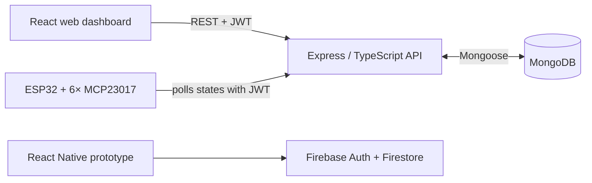

# Smart City Hub — Technical Documentation

Short technical documentation of the system. Setup instructions are in the [README](../README.md). Polska wersja: [DOCUMENTATION.pl.md](DOCUMENTATION.pl.md).

## 1. System overview

The system consists of four components:

1. **API** (`source/server/api`) — the central REST server built with Node.js/Express/TypeScript. Stores users, devices, sensor readings, and state history in MongoDB. Default port: **4200**.
2. **Web dashboard** (`source/web/react`) — a React SPA with separate views for the administrator (user and device management) and the regular user (controlling assigned devices).
3. **ESP32 firmware** (`source/embedded/esp32_arduino`) — polls the API for current device states and drives 96 digital outputs through MCP23017 expanders.
4. **Mobile app** (`source/mobile/react-native`) — React Native; uses Firebase (Auth + Firestore) as an independent backend.

The mobile/Firebase data path is separate from the Node.js/MongoDB path and is not synchronized with it.

## 2. Authentication and roles

- Login: `POST /api/user/auth` returns a **JWT** token (secret: `JWT_SECRET_KEY` env variable).
- The token is passed in the `Authorization: Bearer <token>` or `x-access-token` header.
- Passwords are hashed with **bcrypt** and stored in a separate collection (`password.schema.ts`); session tokens live in the token collection (`token.schema.ts`).
- Middleware:
  - `auth.middleware` — requires a valid JWT ("user" access).
  - `admin.middleware` — requires a JWT plus the `admin` role / `isAdmin` flag.
- The web dashboard stores the token in `sessionStorage`; closing the browser tab clears the local session. The API also checks that the token is still present in the server-side token collection.

## 3. Data models (MongoDB / Mongoose)

| Model | Fields | Description |
|---|---|---|
| **User** | `email` (unique), `name` (unique), `role` (default `user`), `active`, `isAdmin` | User accounts |
| **Password** | `userId`, `password` (bcrypt hash) | Passwords, kept separate from users |
| **Token** | `userId`, `value` | Session tokens |
| **Device** | `deviceId` (Number), `location`, `name` (default `outlet`), `type`, `description`, `editDate` | Device metadata (max 96) |
| **DeviceState** | `deviceId` (ref: Device), `states[]` — `{state: Boolean, timestamp: Date}` | On/off history |
| **Sensor** | `deviceId`, `temperature`, `pressure`, `humidity`, `readingDate` | Sensor readings |

## 4. API endpoints

All routes are prefixed with `/api`. Legend: 🔓 public, 👤 requires JWT, 🛡️ requires the admin role.

### Users — `/api/user`

| Method | Path | Access | Description |
|---|---|---|---|
| POST | `/create` | 🛡️ | Create a user |
| POST | `/auth` | 🔓 | Log in, returns a JWT |
| DELETE | `/logout` | 👤 | Log out and invalidate the current token |

### Devices — `/api/device`

| Method | Path | Access | Description |
|---|---|---|---|
| GET | `/latest` | 🛡️ | Latest device data |
| GET | `/get/:location` | 🛡️ | Devices by location |
| GET | `/user/get` | 👤 | Devices assigned to the logged-in user |
| GET | `/all/:id` | 🛡️ | All entries for a device |
| GET | `/:id` | 🛡️ | A single device |
| POST | `/update` | 🛡️ | Add / update a device |
| DELETE | `/all` | 🛡️ | Delete all devices |
| DELETE | `/:id` | 🛡️ | Delete a device |

### Device states — `/api/state`

| Method | Path | Access | Description |
|---|---|---|---|
| GET | `/iot/all` | 👤 | Current states of all devices — used by the ESP32 |
| GET | `/user/latest` | 👤 | Latest states of the user's devices |
| GET | `/latest` | 🛡️ | Latest states (all devices) |
| GET | `/all` | 🛡️ | Full state history |
| GET | `/:id` | 🛡️ | State of a specific device |
| POST | `/user/update` | 👤 | Change a device state as a user |
| POST | `/update`, `/update/:id` | 🛡️ | Change a state as an administrator |
| DELETE | `/all`, `/:id` | 🛡️ | Delete state history |

### Sensors — `/api/sensor`

| Method | Path | Access | Description |
|---|---|---|---|
| GET | `/all/latest` | 🔓 | Latest readings from all sensors |
| GET | `/all` | 🔓 | Latest 20 readings for each configured sensor |
| GET | `/all/:num` | 🛡️ | Return the last positive *num* readings for each configured sensor |
| GET | `/:id` | 🛡️ | Readings from a sensor |
| POST | `/iot/update` | 🛡️ | Validate and store a batch of sensor readings |
| POST | `/update/:id` | 🛡️ | Update a reading |
| DELETE | `/all`, `/:id` | 🛡️ | Delete readings |

## 5. Web dashboard — flow

1. `Login.jsx` → `POST /api/user/auth` → the JWT is stored for the current browser tab in `sessionStorage`.
2. The router (`App.jsx`) redirects based on role: `Dashboard` (user) or `AdminDashboard` (admin); routes are protected by `PrivateRoutes`.
3. User: `UsersTable` fetches devices from `GET /api/device/user/get` and toggles states via `POST /api/state/user/update`.
4. Administrator: tabs *addNewUser* (`POST /api/user/create`), *addNewDevice* (`POST /api/device/update`), and *controlPanel* (`AdminsTable` — controls all devices).

## 6. ESP32 firmware

- **Hardware:** ESP32 + 6× MCP23017 on the I2C bus (addresses `0x22`–`0x27`), 96 outputs in total; SDA=21, SCL=22; UART at 9600 baud.
- **Operation:** after connecting to WiFi, the sketch periodically calls `GET /api/state/iot/all` (with a token in the `x-access-token` header), parses the JSON response (`ArduinoJson`), and sets the expander pins according to the received states.
- **Configuration:** copy `secrets.example.h` to the ignored `secrets.h` and set the WiFi SSID, API URL, and bearer token before flashing.

## 7. Environment configuration

| Component | Variable | Description |
|---|---|---|
| API | `PORT` | Server port (default 4200) |
| API | `JWT_SECRET_KEY` | JWT signing secret |
| API | `MONGODB_URI` | MongoDB Atlas connection string |
| Web | `VITE_API_URL` | API address, e.g. `http://localhost:4200/api` |
| Mobile | `firebaseConfig.local.ts` | Local Firebase web configuration copied from the checked-in template |
| Firmware | `secrets.h` | Local Wi-Fi SSID, API URL and bearer token copied from `secrets.example.h` |

`.env` files are not versioned (`.gitignore`).

## 8. Known limitations / notes

- The 96-device limit comes from the hardware (6 expanders × 16 outputs) and is reflected in the API configuration.
- The API has focused sensor-route regression tests and the mobile project retains one React Native render smoke test. The web dashboard has no automated test suite. There is no Docker/CI configuration.
- The web dashboard passes its ESLint task. The archived mobile tree's ESLint task currently fails, predominantly because its CRLF files conflict with the checked-in Prettier end-of-line rule; this formatting debt is not corrected automatically because it would rewrite most of that project.
- Firmware credentials are supplied through the ignored `secrets.h`; changing them still requires recompilation.
- The mobile app uses Firebase instead of the Node.js API — the two backends are not synchronized.
- GraphQL client/core packages are installed, but there is no active GraphQL schema or endpoint; REST is the implemented interface.
